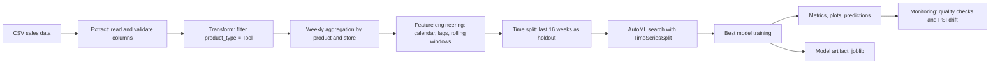
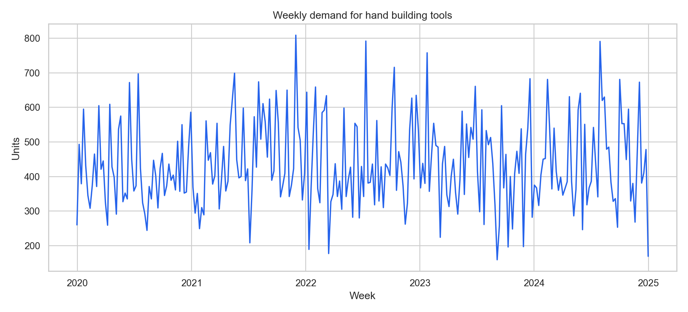
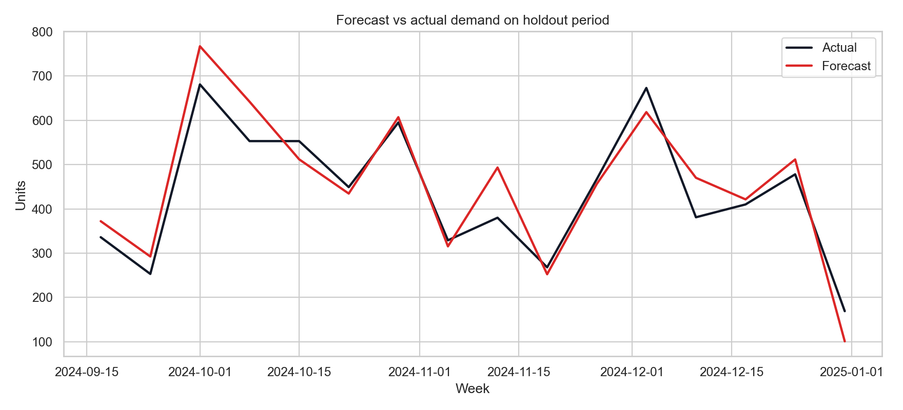
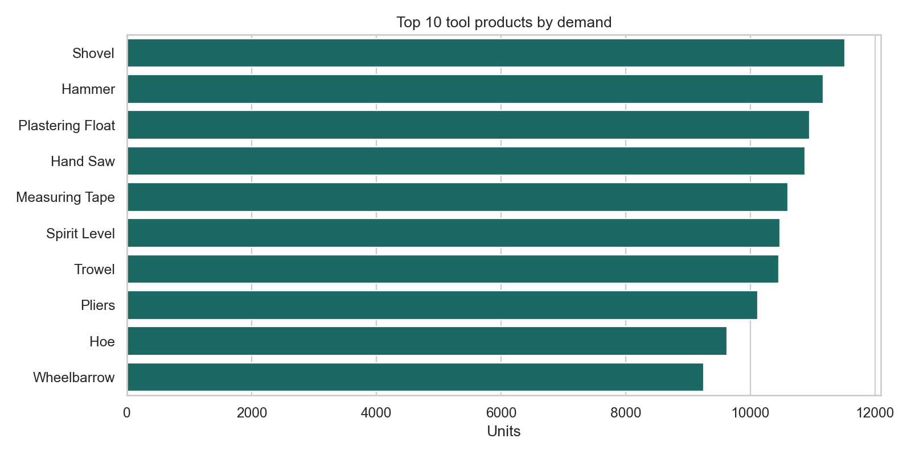
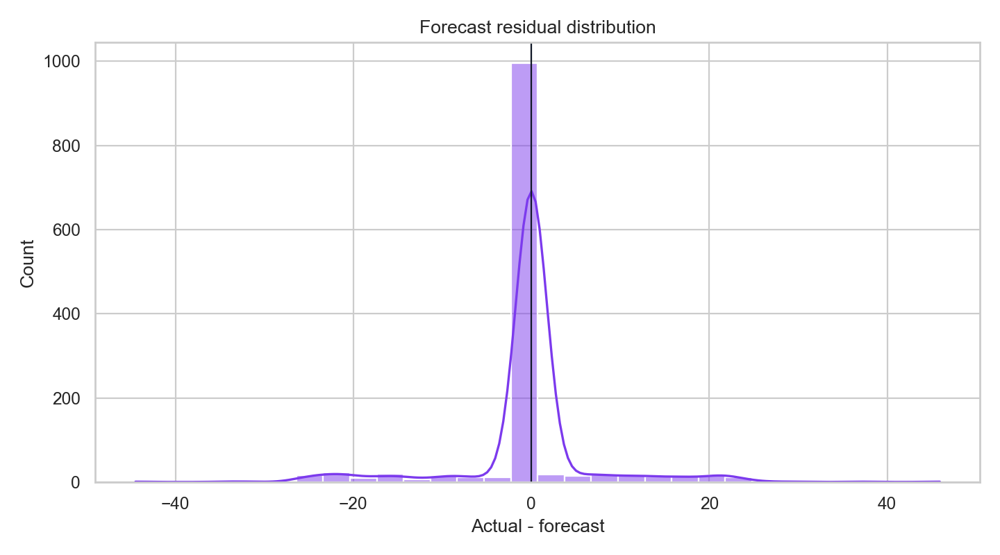

# Фамилия Имя - Автоматизированная ML-система для прогнозирования спроса на ручные строительные инструменты

> Перед сдачей замените `Фамилия Имя` и ссылку на GitHub на реальные данные студента.

GitHub: https://github.com/USERNAME/building-tools-demand-forecasting

## 1. Описание бизнес-задачи

Проект решает задачу прогнозирования недельного спроса на ручные строительные инструменты в сети магазинов строительных материалов. Для бизнеса такой прогноз нужен, чтобы:

- планировать закупки молотков, пил, рулеток, шпателей, тачек и других инструментов;
- снижать риск дефицита товара в филиалах;
- уменьшать избыточные складские остатки;
- поддерживать локальное планирование спроса по магазинам.

Исходный датасет: `Building Supply Store Sales 2020-2024`, файл `building_supply_store_sales_2020-2024.csv`. В проекте используется сегмент `product_type = Tool`, так как ниша задания - ручные строительные инструменты.

## 2. Данные и признаки

Исходные поля продаж: товар, бренд, тип товара, единица измерения, количество, цена, выручка, валюта, дата, способ получения заказа, город магазина, тип магазина, клиент и кассир.

Целевая переменная: `demand`, недельная сумма `unit_purchase` по паре `product_name + store_location`.

После ETL получено:

- строк после агрегации и заполнения календаря: `20174`;
- товарно-магазинных рядов: `77`;
- период данных: `2019-12-31 - 2024-12-31`;
- тестовый период: последние `16` недель.

Основные признаки:

- категориальные: `product_name`, `brand`, `store_location`, `type_store`;
- календарные: `week`, `month`, `quarter`, `year`, `week_index`;
- лаговые: `lag_1`, `lag_2`, `lag_4`, `lag_8`;
- скользящие статистики: `rolling_mean_4`, `rolling_mean_8`, `rolling_std_4`;
- коммерческие: `avg_price`, `orders`, `delivery_share`.

## 3. Схема ML-пайплайна



## 4. ETL: Extract, Transform, Load

Extract:

- загрузка `building_supply_store_sales_2020-2024.csv`;
- проверка обязательных колонок в `src/demand_forecasting/data.py`;
- преобразование `date` в datetime.

Transform:

- фильтрация ручных инструментов: `product_type = Tool`;
- агрегация транзакций до недельного спроса;
- построение полного календаря недель для каждой пары товар-магазин;
- заполнение пропусков нулевым спросом;
- создание лаговых и календарных признаков.

Load:

- сохранение обученной модели в `models/demand_forecast_model.joblib`;
- сохранение метрик в `reports/metrics.json`;
- сохранение прогнозов в `reports/holdout_predictions.csv` и `outputs/latest_forecast.csv`;
- сохранение графиков в `reports/figures/`.

## 5. AutoML и модель

Автоматизация ML реализована через `GridSearchCV` и `TimeSeriesSplit`. Пайплайн автоматически сравнивает несколько семейств моделей и гиперпараметров:

- `Ridge`;
- `RandomForestRegressor`;
- `HistGradientBoostingRegressor`.

Для категориальных признаков используется `OneHotEncoder`, для числовых - `StandardScaler`. Лучший алгоритм выбирается по cross-validation на временных разбиениях, что снижает риск утечки будущих данных.

Лучшая модель после запуска:

- модель: `RandomForestRegressor`;
- `max_depth`: `8`;
- `min_samples_leaf`: `3`;
- `n_estimators`: `160`;
- лучший CV score: `-2.603` по MAE.

## 6. Метрики качества

Holdout: последние 16 недель.

| Метрика | Значение |
|---|---:|
| MAE | 2.780 |
| RMSE | 7.223 |
| SMAPE | 11.943% |
| MAPE для ненулевого спроса | 199.194% |
| R2 | 0.729 |

MAPE получился высоким из-за большого числа товарно-магазинных недель с нулевым или очень малым спросом. Для такой задачи более устойчивыми являются MAE, RMSE и SMAPE.

## 7. Визуализации









## 8. Тестирование

Тесты реализованы через `pytest`:

- проверка фильтрации `product_type = Tool`;
- проверка недельной агрегации спроса;
- проверка генерации лаговых признаков;
- проверка набора признаков модели;
- проверка расчёта метрик.

Команда:

```bash
pytest -q
```

Результат локального запуска:

```text
7 passed in 1.46s
```

## 9. Docker-контейнер

Dockerfile:

```dockerfile
FROM python:3.11-slim

ENV PYTHONDONTWRITEBYTECODE=1 \
    PYTHONUNBUFFERED=1 \
    PIP_NO_CACHE_DIR=1

WORKDIR /app

RUN useradd --create-home --shell /bin/bash appuser

COPY requirements.txt pyproject.toml ./
RUN pip install --upgrade pip && pip install -r requirements.txt

COPY src ./src
COPY tests ./tests
COPY config.yml ./
COPY building_supply_store_sales_2020-2024.csv ./
COPY data ./data

RUN mkdir -p models reports/figures outputs && chown -R appuser:appuser /app
USER appuser

CMD ["python", "-m", "demand_forecasting.cli", "train", "--config", "config.yml"]
```

Назначение контейнеризации:

- воспроизводимость окружения и зависимостей;
- изоляция ML-пайплайна от локальной машины;
- запуск от непривилегированного пользователя `appuser`;
- отключение `.pyc` и pip cache для уменьшения лишних файлов;
- удобный запуск обучения в CI/CD или на сервере.

Команды:

```bash
docker build -t building-tools-demand-forecasting .
docker run --rm building-tools-demand-forecasting
```

## 10. CI/CD

CI/CD настроен в `.github/workflows/ci.yml`.

Pipeline GitHub Actions выполняет:

- checkout репозитория;
- установку Python 3.11;
- установку зависимостей;
- запуск `pytest`;
- сборку Docker image.

Использованные команды Git:

```bash
git init
git add .
git commit -m "Initial ML demand forecasting pipeline"
git branch -M main
git remote add origin https://github.com/USERNAME/building-tools-demand-forecasting.git
git push -u origin main
git checkout -b feature/etl
git add src/demand_forecasting/data.py tests/test_data_pipeline.py
git commit -m "Add ETL and feature engineering"
git push -u origin feature/etl
git checkout main
git merge feature/etl
```

Для командной работы нужно создавать отдельные ветки участников и оформлять pull request на GitHub.

## 11. Мониторинг

Мониторинг реализован в `src/demand_forecasting/monitor.py`.

Контроль качества данных:

- доля пропусков по каждому признаку;
- количество товарно-магазинных рядов;
- проверка периода данных;
- контроль превышения допустимой доли пропусков.

Мониторинг дрейфа данных:

- PSI между train и holdout для числовых признаков;
- уровни предупреждений: `0.10` и `0.25`;
- отчёты: `reports/monitoring_report.json`, `reports/drift_report.csv`, `reports/monitoring_summary.md`.

Локальный результат мониторинга:

- строк: `20174`;
- товарно-магазинных рядов: `77`;
- пропуски: `0%` по всем подготовленным признакам;
- предупреждения по PSI обнаружены у календарных признаков `week`, `month`, `quarter`, `year`, `week_index`, что ожидаемо при сравнении последних недель 2024 года с историческим train-периодом.

Мониторинг инфраструктуры:

- фиксируется время обучения в `reports/metrics.json`;
- Docker ограничивает окружение и позволяет запускать пайплайн одинаково на локальной машине, сервере и в CI;
- в промышленной версии можно добавить Prometheus/Grafana для CPU/RAM и MLflow для истории экспериментов.

Команда:

```bash
python -m demand_forecasting.cli monitor --config config.yml
```

## 12. Запуск проекта

Установка:

```bash
python -m venv .venv
.venv\Scripts\activate
pip install -r requirements.txt
pip install -e .
```

Обучение:

```bash
python -m demand_forecasting.cli train --config config.yml
```

Мониторинг:

```bash
python -m demand_forecasting.cli monitor --config config.yml
```

Прогноз:

```bash
python -m demand_forecasting.cli predict --config config.yml
```

## 13. Структура проекта

```text
.
├── .github/workflows/ci.yml
├── data/
├── src/demand_forecasting/
├── tests/
├── reports/
├── models/
├── outputs/
├── building_supply_store_sales_2020-2024.csv
├── config.yml
├── Dockerfile
├── pyproject.toml
├── requirements.txt
└── README.md
```

## 14. Выводы для бизнеса

Модель показывает приемлемое качество для автоматического планирования спроса на уровне недельных товарно-магазинных рядов. MAE около `2.8` единицы означает, что типичная ошибка по одной позиции в магазине невелика. Для позиций с редкими продажами важно использовать SMAPE и дополнительную бизнес-логику минимального страхового запаса, так как MAPE нестабилен при малом спросе.

Рекомендации:

- использовать прогноз как основу для еженедельного пополнения складов;
- отдельно контролировать товары с редким спросом;
- переобучать модель ежемесячно или после загрузки новых продаж;
- отслеживать PSI и падение метрик на свежих периодах;
- добавить MLflow для централизованной истории экспериментов.
